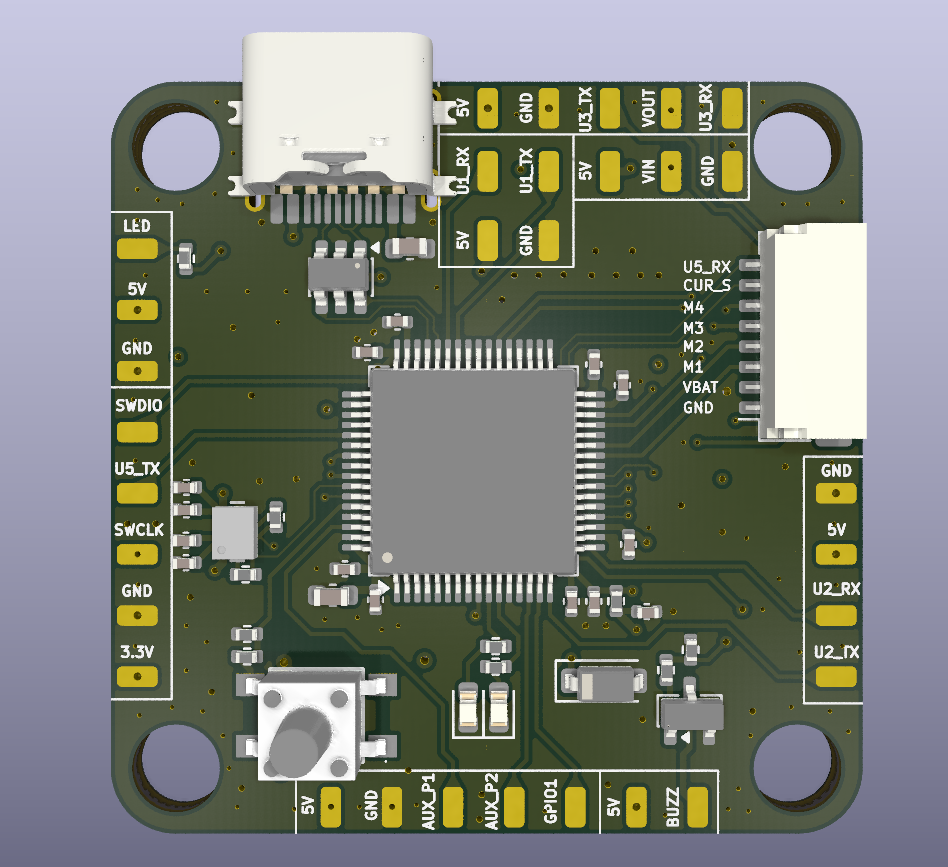
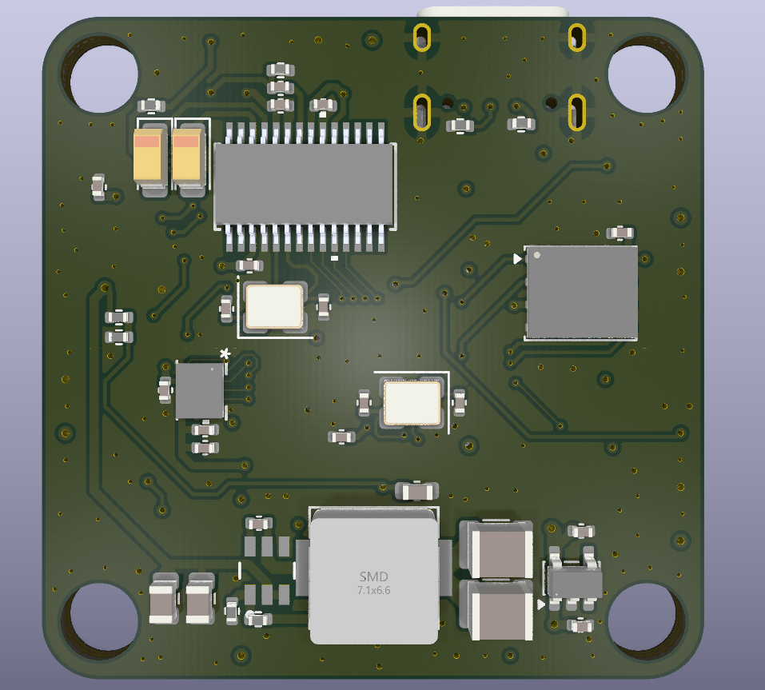
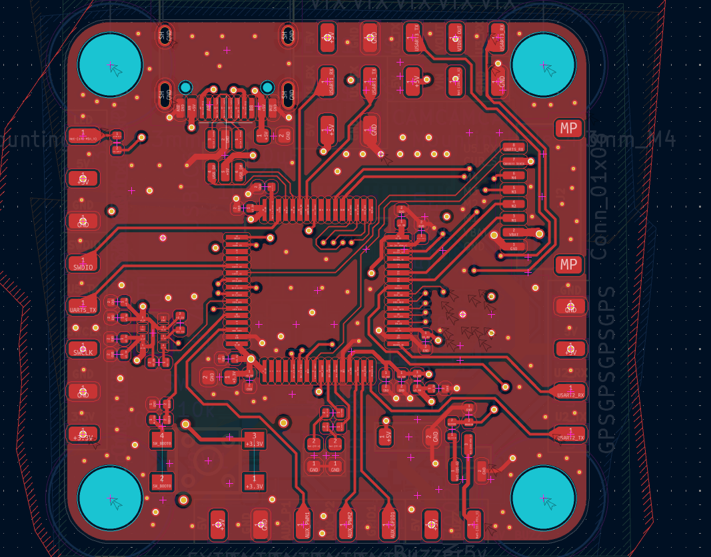
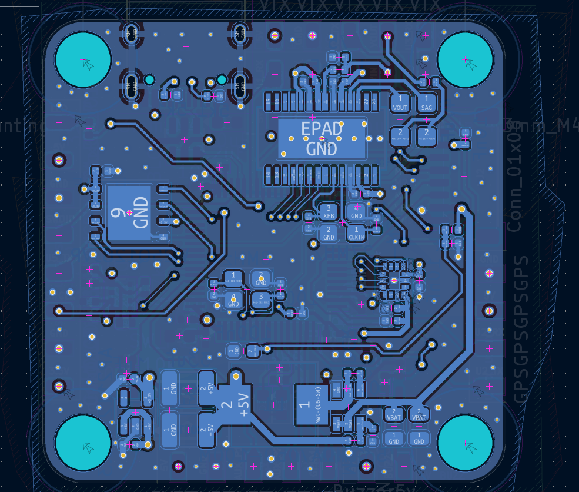
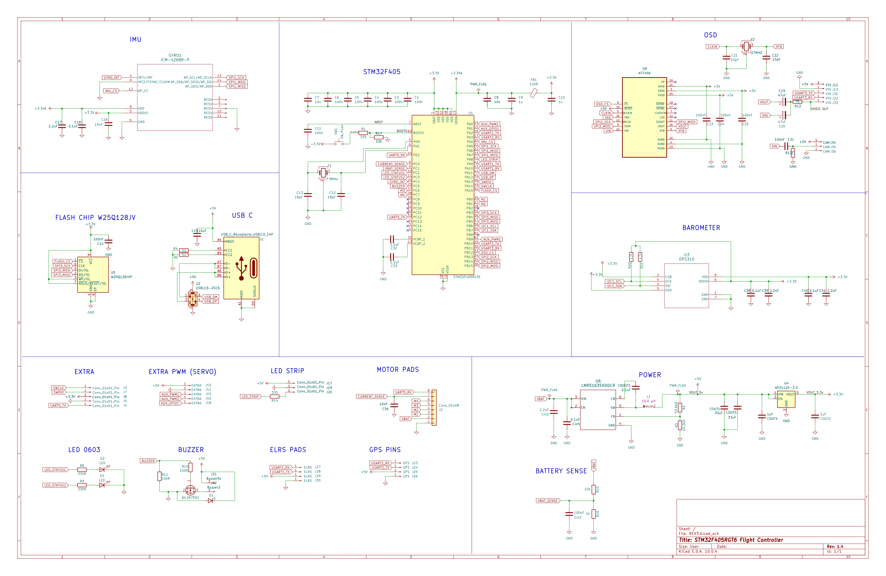

# STM32F405 FPV Flight Controller

An open-hardware, 4-layer FPV flight controller board built around the **STM32F405RGT6**, designed in KiCad. Currently at hardware revision **REV3**. Designed to run **Betaflight**.

## 3D renders

<p align="center">
  
  
</p>

## Features

- **MCU:** STM32F405RGT6 (Arm Cortex-M4F, 168 MHz) — the same MCU family used by most Betaflight/iNav AIO flight controllers
- **IMU:** InvenSense ICM-42688-P 6-axis gyro/accelerometer (SPI)
- **Barometer:** Infineon DPS310 for altitude hold / GPS rescue
- **OSD:** MAX7456 analog on-screen display (camera in / VTX out video overlay)
- **Blackbox flash:** Winbond W25Q128JVP, 128 Mbit SPI NOR flash
- **Power:**
  - LMR51635 synchronous buck converter — VBAT down to a regulated 5V rail for the FC and video/VTX peripherals
  - AP2112K-3.3 LDO for the 3.3V digital rail, with a separately filtered +3.3VA analog rail for the IMU
- **USB:** USB-C receptacle with USBLC6-2SC6 ESD protection for DFU flashing / configurator access
- **I/O:** 5 UARTs broken out (UART1, UART2, UART3, UART5), 4 motor signal outputs (M1–M4), current sensor input, buzzer, status LED, boot/reset button, SWD programming header, and general purpose AUX/GPIO pads
- **Board:** 4-layer stack-up (signal / GND plane / power plane / signal)

## PCB layout (copper layers)

| Top copper | Bottom copper |
|---|---|
|  |  |

## Schematic



Full-resolution PDF: [`SCHEMATIC_PDF/REV3.pdf`](SCHEMATIC_PDF/REV3.pdf)

## Connector map

Reference the top-side silkscreen (visible in the top 3D render above) for exact pad locations. Grouped by function:

| Header | Signals |
|---|---|
| SWD / debug | `SWDIO`, `SWCLK`, `GND`, `3.3V`, `U5_TX` |
| Status LED | `LED`, `5V`, `GND` |
| UART1 (GPS / receiver) | `U1_RX`, `U1_TX`, `5V`, `GND` |
| UART3 (VTX / camera) | `U3_TX`, `U3_RX`, `5V`, `GND`, `VOUT` |
| Power in | `VIN`, `5V`, `GND` |
| UART2 | `U2_RX`, `U2_TX`, `5V`, `GND` |
| Motor / ESC connector | `M1`, `M2`, `M3`, `M4`, `VBAT`, `GND`, `CUR_S` (current sense), `U5_RX` (ESC telemetry) |
| AUX | `AUX_P1`, `AUX_P2`, `GPIO1`, `5V`, `GND` |
| Buzzer | `BUZZ`, `5V` |

## Repository structure

```
.
├── hardware/            KiCad 10 project (schematic, PCB, project settings)
│   ├── REV3.kicad_pro
│   ├── REV3.kicad_sch
│   ├── REV3.kicad_pcb
│   ├── REV3.kicad_prl
│   └── fp-lib-table
├── SCHEMATIC_PDF/
│   └── REV3.pdf         Exported schematic PDF
└── docs/
    └── images/          3D renders, copper layer renders, schematic export
```

## Opening the project

The design was created in **KiCad 10.0**. Open `hardware/REV3.kicad_pro` in KiCad to view/edit the schematic and PCB.

## Firmware compatibility

Built for **Betaflight**. Every IC on this board is natively supported by Betaflight:

- STM32F405RGT6 — supported target MCU family
- ICM-42688-P — supported gyro/accelerometer
- MAX7456 — supported OSD chip
- W25Q128JVP — supported blackbox flash

Since this is a custom PCB (not a stock/off-the-shelf target), it needs a **custom unified target** in Betaflight Configurator with resource mapping matching this schematic's pin assignments: gyro on SPI1 (`PA5`/`PA6`/`PA7`, CS `PA4`), OSD on SPI2 (`PB12`/`PB14`/`PB15`, CS `PB11`), blackbox flash on SPI3 (`PB3`/`PB4`/`PB5`, CS `PA15`), motors `M1`–`M4` on `PB0`/`PB1`/`PC6`/`PC7`, and UART1/2/3/5 as broken out on the connectors above — see the schematic for the full pin list. No target file is included in this repo yet.

## Status / notes

- This repository currently contains the hardware design only (schematic + PCB). No firmware/target file is included yet.
- DRC exclusions present in the board file are inherited from the source project and should be reviewed before fabrication.

## ⚠️ Disclaimer

**This exact revision (REV3) has not been manufactured or tested yet.** It is a corrected revision of a previously manufactured and tested board, so it is very similar to a known-working unit but has not itself been built/verified. The fixes made since the last manufactured/tested version:

- The barometer (DPS310) was not connected to 3.3V — fixed.
- The boot/reset button was tied high and did not function — fixed.

Real photos of the assembled, tested board will be added once this revision is built.

## License

Licensed under the [CERN Open Hardware Licence Version 2 - Strongly Reciprocal (CERN-OHL-S v2)](LICENSE). Anyone who manufactures or modifies this design must make their modified source available under the same licence.
